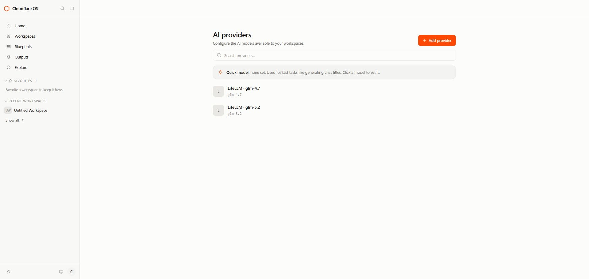
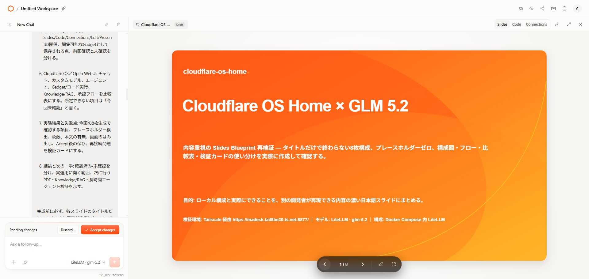
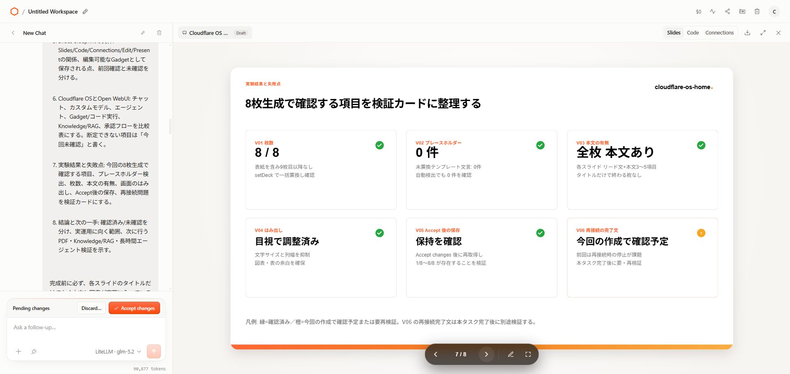
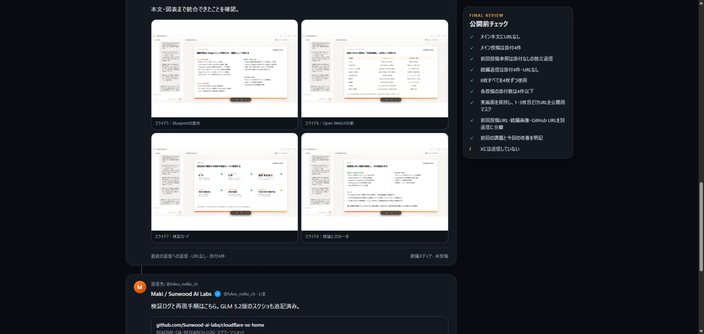

# Cloudflare OS × Slides × GLM 5.2 実験記録

この記事は、Cloudflare OS上のSlides GadgetをGLM 5.2で再検証し、その結果をXへ公開したときの一次記録です。後日のQiita記事や長文記事では、このファイルをベースに時系列・スクリーンショット・公開スレッドを再利用できます。

- 実験日: 2026-08-08
- 対象リポジトリ: [Sunwood-ai-labs/cloudflare-os-home](https://github.com/Sunwood-ai-labs/cloudflare-os-home)
- 実験コミット: [3edede3](https://github.com/Sunwood-ai-labs/cloudflare-os-home/commit/3edede378140e3825dedce65791652a7f8ecfdd5)
- 対象アカウント: [@hAru_mAki_ch](https://x.com/hAru_mAki_ch)
- 公開状態: Xスレッド公開済み

## 1. 結論

Cloudflare OSのモデル選択をプロジェクト内LiteLLM経由の glm-5.2 に切り替え、内蔵Slides Blueprintへ「タイトルだけでなく本文・図表まで含む8枚」を依頼した。

目視で初回生成物を確認し、表紙のコントラストと本文中のプレースホルダー例を修正した後、Accept changesで8枚を保存できた。最終確認では次を確認している。

- 8枚すべてにタイトル・リード・具体的な本文がある
- 構成図、実行フロー、比較表、検証カードを含む
- プレースホルダー文字列は0件
- Accept changes後も8枚が保存されている
- X向け画像は1投稿4枚以内に分割されている
- 前回投稿URL、続編画像、GitHub URLは別々の返信に分離されている

## 2. 公開済みXスレッド

Xの添付上限と可読性を考え、実際の公開スレッドは次の4ポスト構成にした。返信はすべて直前のポストIDを親にした直列チェーンである。

| 順番 | 役割 | 添付 | 親ポスト | 公開URL |
|---|---|---:|---|---|
| 1 | メイン投稿。GLM 5.2への切替と8枚生成の結果 | 4枚（1〜4） | — | [2086003612577300719](https://x.com/hAru_mAki_ch/status/2086003612577300719) |
| 2 | 前回投稿の参照と前回の経緯 | なし | 2086003612577300719 | [2086004308009762957](https://x.com/hAru_mAki_ch/status/2086004308009762957) |
| 3 | 続編の説明と生成物の中身 | 4枚（5〜8） | 2086004308009762957 | [2086004335071355100](https://x.com/hAru_mAki_ch/status/2086004335071355100) |
| 4 | リポジトリ・検証ログ案内 | なし | 2086004335071355100 | [2086004347108999519](https://x.com/hAru_mAki_ch/status/2086004347108999519) |

比較対象となった前回の6枚実験はこちら。

- [Cloudflare OS × Slides やってみた❶](https://x.com/hAru_mAki_ch/status/2085986613587505630)

### 公開ペイロード

#### 1. メイン投稿

    Cloudflare OS × Slides やってみた❷

    今度はGLM 5.2に切り替えて、
    スライドの中身までちゃんと作らせてみたぞ！！！

    ✅ 8枚を生成
    ✅ 構成図・実行フロー・比較表・検証カード
    ✅ プレースホルダー0件
    ✅ Accept changes後も8枚を保存

    前回はタイトル中心＆プレースホルダーが残ったけど、
    今回は目視で修正までやり切った！！！

#### 2. 前回投稿参照返信（添付なし）

    前回の投稿はこちら。

    6枚の生成結果と、再接続時に完了文が止まっても画面のDraftを確認した話。
    https://x.com/hAru_mAki_ch/status/2085986613587505630

#### 3. 続編メディア返信

    続編ではGLM 5.2に切り替え。
    5〜8枚目をここに載せるぞ！！！

    本文・図表まで統合できたことを確認。

#### 4. GitHub返信

    検証ログと再現手順はこちら。GLM 5.2版のスクショも追記済み。
    https://github.com/Sunwood-ai-labs/cloudflare-os-home

## 3. 実験の目的

前回の Cloudflare OS × Slides やってみた❶ では、6枚のスライドタイトル生成と保存は確認できた。一方で、次の課題が残った。

1. スライドの中身がタイトル中心になりやすい
2. プレースホルダー文字列が本文に残る
3. コンテナ再起動・再接続の後、エージェントの完了文が止まることがある
4. 完了文だけでは、実際に生成物が保存されたか判断しにくい

今回の目的は、モデルをGLM 5.2へ切り替え、本文・図表を含む実用的なスライドを生成できるか、さらに目視修正と保存確認まで含めたエージェント的な流れを確認することだった。

## 4. 実験環境と条件

| 項目 | 内容 |
|---|---|
| UI | Cloudflare OS |
| モデル接続 | プロジェクト内LiteLLM |
| モデル | glm-5.2 |
| 作成機能 | 内蔵 Slides Blueprint / Slides Gadget |
| アクセス経路 | Tailscale経由のCloudflare OS |
| 生成枚数 | 8枚 |
| 画像比率 | X向け3:2、1920×1280 |
| X添付分割 | 4枚＋4枚 |
| 保存操作 | Accept changes |
| 公開前確認 | Tailscale限定X投稿シミュレーター、preflight |

Tailscale上のシミュレーターと画像ギャラリーはプライベートな確認用であり、公開ドキュメントではホスト名を tailnet-host として扱う。

## 5. 実験タイムライン

### 5.1 前回の6枚実験

前回はCloudflare OSからSlides Blueprintを起動し、6枚のタイトルを生成した。途中でコンテナ再起動・再接続によりエージェントの完了文が止まったが、画面側のDraftには生成物が残っていた。

- 前回メイン投稿: [2085986613587505630](https://x.com/hAru_mAki_ch/status/2085986613587505630)
- 前回の5〜6枚目返信: [2085986808115159151](https://x.com/hAru_mAki_ch/status/2085986808115159151)
- 前回のGitHub返信: [2085986935550706082](https://x.com/hAru_mAki_ch/status/2085986935550706082)

この経験から、エージェントの完了メッセージだけでなく、画面上の生成物、スライド枚数、保存状態を確認する方針にした。

### 5.2 GLM 5.2への切替

モデル登録・選択状態は次のスクリーンショットで記録している。

- [57-glm-5.2-model-form.png](artifacts/screenshots/57-glm-5.2-model-form.png): GLM 5.2登録フォーム
- [58-glm-5.2-model-configured.png](artifacts/screenshots/58-glm-5.2-model-configured.png): AI Providersに登録されたGLM 5.2
- [59-glm5.2-slide-prompt.png](artifacts/screenshots/59-glm5.2-slide-prompt.png): 内容重視8枚の依頼

### 5.3 初回生成と修正

初回の目視では、表紙タイトルのコントラスト不足と、本文中に残ったプレースホルダー例を確認した。

- 初回目視: [60〜67](artifacts/screenshots/60-glm5.2-slide-1.png)
- 表紙のコントラスト修正: [68-glm5.2-slide-1-final.png](artifacts/screenshots/68-glm5.2-slide-1-final.png)
- 合格条件・本文の修正: [69-glm5.2-slide-2-final.png](artifacts/screenshots/69-glm5.2-slide-2-final.png)
- プレースホルダー0件の検証カード: [70-glm5.2-slide-7-final.png](artifacts/screenshots/70-glm5.2-slide-7-final.png)

### 5.4 Accept changes後の確定版

Accept changes後に、1枚目から8枚目までを再確認した。元の実画面スクリーンショットは加工せず、71〜78番に保存している。

| スライド | 内容 | Accept後の元スクショ |
|---:|---|---|
| 1 | Cloudflare OS Home × GLM 5.2 表紙 | [71](artifacts/screenshots/71-glm5.2-slide-1-accepted.png) |
| 2 | 合格条件・本文の要求 | [72](artifacts/screenshots/72-glm5.2-slide-2-accepted.png) |
| 3 | Browser・Tailscale・Cloudflare OS・LiteLLM・GLM 5.2構成図 | [73](artifacts/screenshots/73-glm5.2-slide-3-accepted.png) |
| 4 | 依頼からAcceptまでの実行フロー | [74](artifacts/screenshots/74-glm5.2-slide-4-accepted.png) |
| 5 | Slides Blueprintの実体 | [75](artifacts/screenshots/75-glm5.2-slide-5-accepted.png) |
| 6 | Cloudflare OSとOpen WebUIの比較 | [76](artifacts/screenshots/76-glm5.2-slide-6-accepted.png) |
| 7 | 検証カード | [77](artifacts/screenshots/77-glm5.2-slide-7-accepted.png) |
| 8 | 結論と次の一手 | [78](artifacts/screenshots/78-glm5.2-slide-8-accepted.png) |

### 5.5 X添付用メディアの作成

Xの添付上限に合わせ、元の実スクショから3:2の添付用フレームを作成した。

- [79〜86](artifacts/screenshots/79-x-media-glm5.2-slide-1-original-frame.png): スライド1〜8の添付用フレーム
- [87-x-media-glm5.2-slide-1-public-redacted.png](artifacts/screenshots/87-x-media-glm5.2-slide-1-public-redacted.png): 表紙の公開用URLマスク版
- [89-x-media-glm5.2-slide-3-public-redacted.png](artifacts/screenshots/89-x-media-glm5.2-slide-3-public-redacted.png): 構成図の公開用URLマスク版

1・3枚目だけは画面内にtailnet URLやDocker内部URLが含まれるため、X公開用に接続先をマスクした。71〜78番の元画像は検証証跡として変更していない。

### 5.6 投稿シミュレーターの修正

初版シミュレーターでは、前回投稿URLと5〜8枚目の画像を同じ返信に入れていたため、情報が混ざって見にくかった。

- 初版証跡: [91](artifacts/screenshots/91-x-post-simulator-glm5.2-4plus4-top.png)、[92](artifacts/screenshots/92-x-post-simulator-glm5.2-4plus4-replies.png)、[93](artifacts/screenshots/93-x-post-simulator-glm5.2-github-reply.png)
- 修正版メイン: [94](artifacts/screenshots/94-x-post-simulator-glm5.2-separated-main.png)
- 修正版の前回投稿参照返信: [95](artifacts/screenshots/95-x-post-simulator-glm5.2-previous-post-reply.png)
- 修正版の5〜8枚目返信: [96](artifacts/screenshots/96-x-post-simulator-glm5.2-continuation-media-reply.png)
- 修正版のGitHub返信: [97](artifacts/screenshots/97-x-post-simulator-glm5.2-github-reply.png)

修正版では、次の順番を画面上で確認してから投稿した。

1. メイン投稿＋1〜4枚目
2. 前回投稿URLを含む添付なし返信
3. 本文・図表の説明＋5〜8枚目
4. GitHub URLの別返信

## 6. スクリーンショットの証拠体系

| 番号 | 種別 | 用途 | 加工 |
|---|---|---|---|
| 57〜59 | モデル・依頼条件 | GLM 5.2の選択と依頼内容 | 実画面 |
| 60〜67 | 初回目視 | 初回生成の状態確認 | 実画面 |
| 68〜70 | 修正後 | コントラスト・本文・検証カード | 実画面 |
| 71〜78 | Accept後 | 8枚の確定版 | 実画面、原本保持 |
| 79〜86 | X添付用 | 8枚の3:2フレーム | X向けフレーム化 |
| 87・89 | 公開安全版 | URLを含む1・3枚目 | URL部分のみマスク |
| 91〜93 | 初版シミュレーター | 分離前の投稿構成 | 修正版では不使用 |
| 94〜97 | 最終シミュレーター | 分離後の投稿構成 | 公開前の最終証跡 |

画像ギャラリーの一覧は[artifacts/screenshots/index.html](artifacts/screenshots/index.html)にまとめている。

### 6.1 主要スクリーンショット

記事の導入で使いやすい4枚を抜粋する。各画像をクリックすると元のPNGを開ける。

<table>
  <tr>
    <td width="25%" valign="top"> モデル選択: LiteLLM経由のGLM 5.2</td>
    <td width="25%" valign="top"> 修正後の表紙</td>
    <td width="25%" valign="top"> プレースホルダー0件の検証カード</td>
    <td width="25%" valign="top"> 分離後の5〜8枚目返信</td>
  </tr>
</table>

## 7. 公開前チェックと実績

投稿前の最終ペイロードに対する確認結果は次のとおり。

| チェック | 結果 |
|---|---|
| 対象アカウント | @hAru_mAki_ch |
| メイン本文 | URLなし、186文字 |
| 返信本文 | 104 / 54 / 87文字 |
| 画像 | 8枚すべて1920×1280、3:2 |
| 1投稿あたりの添付 | 4枚以下 |
| 前回投稿URL | 独立した添付なし返信 |
| GitHub URL | 最後の独立返信 |
| Tailscaleシミュレーター | ok: true |
| X送信 | 2026-08-08に実施済み |
| ローカル履歴 | 4件、親子関係・添付数を保存済み |

メイン投稿を公開した後に同じ全文でpreflightを再実行すると、重複防止が働いて「duplicate post rejected」になる。これはメイン投稿の再送を防ぐ正常な挙動であり、返信継続時は返信本文・メディア・シミュレーターの検証を別ステージで行った。

## 8. 今回確認できたこと／未確認のこと

### 確認できたこと

- GLM 5.2をCloudflare OSのモデル選択から利用できた
- Slides Blueprintに本文・図表を含む8枚を生成させられた
- 構成図、実行フロー、比較表、検証カードを含む資料を作成できた
- 目視で生成物を修正し、Accept changes後の保存を確認できた
- Cloudflare OSとOpen WebUIの比較を、未確認事項と混同しない形で資料化した
- X公開時に4枚＋4枚へ分割し、URLを別返信にできた

### 今回は断定していないこと

- PDFファイルとしての実体ダウンロード
- Knowledge / RAGの実運用
- 外部サービス連携の網羅的な動作
- 長時間実行や再接続時の安定性
- GLM 5.2の品質・速度・費用に関する一般化されたベンチマーク

## 9. 後日の記事化メモ

記事にする場合は、次の流れが自然である。

1. Cloudflare OSを単純なチャットではなく、生成物を確認するエージェント的な作業環境として見る
2. 前回の6枚実験で起きた「完了文停止」とDraft残存を説明する
3. GLM 5.2へ切り替え、タイトル中心から本文・図表重視へ依頼を変えた理由を書く
4. 初回目視でコントラストとプレースホルダーを見つけ、Accept前に修正した流れを示す
5. 8枚の内容をスライド別に紹介する
6. X投稿では画像だけでなく、前回URL・続編画像・GitHub URLの返信構造も設計したことを書く
7. 確認できたことと未確認事項を分け、過剰な結論を避ける

## 10. 関連記録

- [RESEARCH-LOG.md](RESEARCH-LOG.md): 全体の調査ログ
- [QA.md](QA.md): 検証チェックリスト
- [README.md](README.md): プロジェクト概要（英語）
- [README.ja.md](README.ja.md): プロジェクト概要（日本語）
- X投稿シミュレーター: Tailscale限定の確認用URL
- スクリーンショットギャラリー: Tailscale限定の確認用URL
