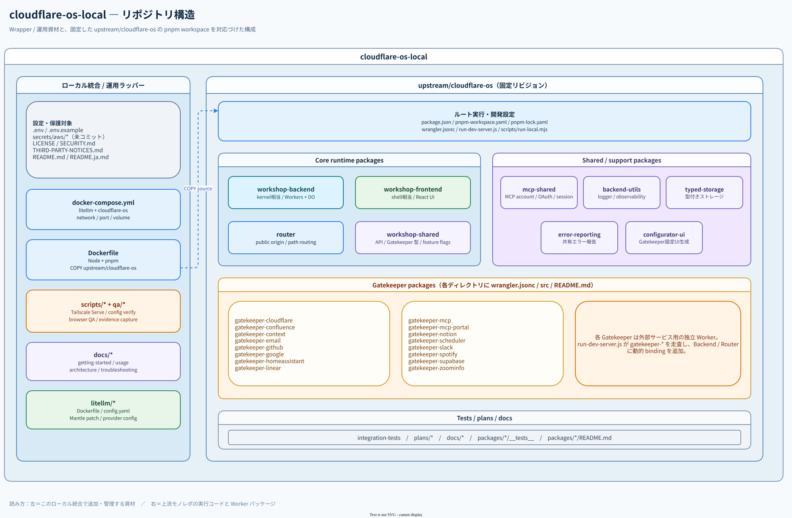

<div align="center">
  
  <h1>Cloudflare OS Home</h1>
  <p>Cloudflare OS + プロジェクト内LiteLLM + Docker Compose + Tailscaleのセルフホスト構成。</p>
  <p>
    <a href="https://github.com/Sunwood-ai-labs/cloudflare-os-home/actions/workflows/ci.yml"></a>
    <a href="https://github.com/Sunwood-ai-labs/cloudflare-os-home/actions/workflows/pages.yml"></a>
    <a href="LICENSE"></a>
    <a href="https://docs.docker.com/compose/"></a>
  </p>
  <p>
    <a href="README.md">English</a>
    ·
    <a href="https://sunwood-ai-labs.github.io/cloudflare-os-home/ja/">ドキュメント</a>
    ·
    <a href="https://github.com/Sunwood-ai-labs/cloudflare-os-home-lab">検証Lab</a>
    ·
    <a href="https://github.com/Sunwood-ai-labs/cloudflare-os-home/issues">Issues</a>
  </p>
</div>

## ✨ これは何か

Cloudflare OS Homeは、Cloudflare OSをエージェント中心のワークスペースとして試すための、再現可能なローカル実行環境です。上流ソース、プロジェクト内LiteLLM、Docker Composeネットワーク、Tailscale Serve手順、ブラウザーQAを一つの運用リポジトリにまとめています。

非公式のローカル統合であり、Cloudflareがホストする製品や公式ディストリビューションではありません。詳細な実験、スクショ、HyperFrames、機能の結論は分離した[Cloudflare OS Home Lab](https://github.com/Sunwood-ai-labs/cloudflare-os-home-lab)に保存しています。

## 🚀 含まれるもの

- 既知の上流リビジョンに固定したCloudflare OSソース
- `http://litellm:4000/v1`のOpenAI互換プロジェクト内LiteLLM
- `.env`から認証情報を読む26モデル構成テンプレート
- 外部のOpen WebUIネットワークに依存しないDocker Compose構成
- 任意のTailscale Serveによるtailnet限定HTTPS
- モデル登録、チャット永続化、レスポンシブ表示、Agentic Gadget作成のブラウザーQA
- 詳細な検証を別管理するLabリポジトリへの導線

## 🧭 目的別の入口

| 目的 | 入口 |
| --- | --- |
| ローカルワークスペースを起動する | [クイックスタート](#-クイックスタート) |
| コンテナ構成を理解する | [アーキテクチャ](https://sunwood-ai-labs.github.io/cloudflare-os-home/ja/guide/architecture) |
| Agentの動作を再現する | [Agentスモークテスト](#-エージェントスモークテスト) |
| tailnet限定アクセスを設定する | [Tailscaleアクセス](#-tailscaleアクセス) |
| 再利用可能なサンプルを試す | [Examples](examples/) |
| 実験結果とスクショを見る | [Cloudflare OS Home Lab](https://github.com/Sunwood-ai-labs/cloudflare-os-home-lab) |
| 起動失敗を調べる | [トラブルシュート](https://sunwood-ai-labs.github.io/cloudflare-os-home/ja/guide/troubleshooting) |

## ⚡ クイックスタート

前提: Linux engineを有効にしたDocker DesktopとPowerShell。

```powershell
git clone https://github.com/Sunwood-ai-labs/cloudflare-os-home.git
Set-Location cloudflare-os-home
Copy-Item .env.example .env
notepad .env
docker compose up --build -d
```

`http://localhost:8877`を開き、初回にローカルアカウントを作成してください。最低限、`.env`の`LITELLM_MASTER_KEY`を設定します。プロバイダーAPIキーは利用する経路だけに必要です。AWSプロファイルは任意で、コミット対象にはなりません。

停止:

```powershell
docker compose down
```

名前付きVolumeはローカルWorkerの状態を保持します。状態を意図的に削除するときだけ`docker compose down -v`を使ってください。

## 🔐 環境変数と秘密情報

`.env.example`はコピーできますが、意図的に未完成です。実値は`.env`に置きます。

- `LITELLM_MASTER_KEY` — プロジェクト内LiteLLM API用
- 必要に応じた`ZAI_API_KEY`、`NVIDIA_API_KEY`、`GEMINI_API_KEY`
- 外部ブラウザー接続で使う`CFOS_PUBLIC_BASE_URL`と`CFOS_BACKEND_HOST`
- 任意のBedrock Mantle経路で使うAWSプロファイル

`.env`、`secrets/`、AWSプロファイル、ブラウザー認証情報は絶対にコミットしないでください。[SECURITY.md](SECURITY.md)も確認してください。

## 🧩 アーキテクチャ

```text
ブラウザー
  │ http://localhost:8877 または tailnet限定Tailscale URL
  ▼
Cloudflare OSコンテナ
  │ http://litellm:4000/v1
  ▼
プロジェクト内LiteLLMコンテナ
  │
  ▼
設定済みモデルプロバイダー
```

Cloudflare OSはワークスペース、エージェントループ、Gadgetツール、レビュー可能な変更を担当します。LiteLLMはOpenAI互換のモデルルーティングを担当します。モデルは交換可能で、`glm-4.7`と`glm-5.2`で実行を確認しています。

### 構成図

編集可能なdraw.ioのソースは[`docs/cloudflare-os-architecture.drawio`](docs/cloudflare-os-architecture.drawio)です。リポジトリのREADMEから確認できるように、エクスポートしたSVGも掲載しています。

<p align="center">
  
</p>

<p align="center"><em>実行アーキテクチャ：Docker Compose、Cloudflare OS、Gatekeeper、LiteLLM、外部プロバイダー。</em></p>

<p align="center">
  
</p>

<p align="center"><em>リポジトリ構造：ローカル統合ラッパーと固定した上流モノレポ。</em></p>

## 🌐 Tailscaleアクセス

Tailscale Serveを使うと、一般公開のFunnelを使わずtailnet限定HTTPSにできます。

```powershell
$env:CFOS_PUBLIC_BASE_URL = 'https://<your-tailnet-host>:8877'
$env:CFOS_BACKEND_HOST = '<your-tailnet-host>:8877'
docker compose up -d --force-recreate cloudflare-os
.\scripts\enable-tailscale-serve.ps1
```

ヘルパーが実際のtailnet URLを表示します。tailnet外へ共有する前に、公開範囲と認証方式を確認してください。

## 🤖 エージェントスモークテスト

同梱のスモークテストは、Cloudflare OSに最小Gadgetを作らせ、`server.js`と`client.js`を書かせ、コードを実行して結果を報告させます。認証情報は明示的に環境変数へ設定します。

```powershell
$env:CFOS_USERNAME = 'your-local-account'
$env:CFOS_PASSWORD = 'your-local-password'
$env:BASE_URL = 'http://localhost:8877'
node .\qa\agentic-gadget-smoke.mjs
```

成功すると、`Pending changes`、`Accept changes`、`Discard`を持つGadget Draftが作られます。詳細な解釈とスクショは[Cloudflare OS Home Lab](https://github.com/Sunwood-ai-labs/cloudflare-os-home-lab)に分離しています。

## 🧰 再利用可能なサンプル

[examplesディレクトリ](examples/)に、ローカル実験を繰り返すための安全な入力、期待する結果、実装箇所、制限事項をまとめています。まずは[Gatekeeper：顧客間送信の書き込みブロック](examples/gatekeeper-cross-customer-block/)から試せます。

[実験インデックス](https://github.com/Sunwood-ai-labs/cloudflare-os-home-lab/blob/main/experiments/README.ja.md)では、実際に確認した機能と、それぞれの詳細記録を一覧できます。

サンプルは合成データまたはローカルデータだけを使います。認証情報、実顧客データ、非公開エンドポイント、公開履歴の追跡情報は追加しないでください。

## 🧪 ランタイムQA

CIではComposeファイル、QAスクリプトの構文、公開payload除外、空白を確認し、同じワークフローでVitePressドキュメントもビルドします。実験機能の主張は[LabのQAチェック](https://github.com/Sunwood-ai-labs/cloudflare-os-home-lab/blob/main/QA.md)を参照してください。

## 📚 ドキュメント

- [はじめに](https://sunwood-ai-labs.github.io/cloudflare-os-home/ja/guide/getting-started)
- [使い方](https://sunwood-ai-labs.github.io/cloudflare-os-home/ja/guide/usage)
- [アーキテクチャ](https://sunwood-ai-labs.github.io/cloudflare-os-home/ja/guide/architecture)
- [トラブルシュート](https://sunwood-ai-labs.github.io/cloudflare-os-home/ja/guide/troubleshooting)
- [実験記録と証拠](https://github.com/Sunwood-ai-labs/cloudflare-os-home-lab)

## 📜 ライセンス

本リポジトリはApache-2.0です。上流および第三者の注意事項は[THIRD-PARTY-NOTICES.md](THIRD-PARTY-NOTICES.md)を確認してください。
