<div align="center">
  
  <h1>Cloudflare OS Home</h1>
  <p>Cloudflare OSを中心にした、個人用・セルフホスト型のエージェントワークスペース。</p>
  <p>
    <a href="https://github.com/Sunwood-ai-labs/cloudflare-os-home/actions/workflows/ci.yml"></a>
    <a href="https://github.com/Sunwood-ai-labs/cloudflare-os-home/actions/workflows/pages.yml"></a>
    <a href="LICENSE"></a>
    <a href="https://docs.docker.com/compose/"></a>
  </p>
  <p>
    <a href="README.md">English</a>
    ·
    <a href="https://sunwood-ai-labs.github.io/cloudflare-os-home/ja/">ドキュメント</a>
    ·
    <a href="https://github.com/Sunwood-ai-labs/cloudflare-os-home/issues">Issues</a>
  </p>
</div>

## ✨ これは何か

Cloudflare OS Homeは、Cloudflare OSをエージェント中心のワークスペースとして試すための、再現可能なローカルラボです。上流Cloudflare OS、プロジェクト内LiteLLM、Docker Composeネットワーク、Tailscale Serve手順、スクリーンショット付きの検証結果を一つにまとめています。

目的は実用的な検証です。エージェントにGadgetを作らせ、ファイルを書かせ、コードを実行し、レビュー可能なDraftとして残す流れを確認できます。Cloudflare公式製品や公式ディストリビューションではありません。

## 🚀 含まれるもの

- 既知の上流リビジョンに固定したCloudflare OSソース
- `http://litellm:4000/v1` のOpenAI互換エンドポイントを持つプロジェクト内LiteLLM
- プロバイダー認証情報を`.env`から読む26モデル構成テンプレート
- 外部のOpen WebUIネットワークに依存しないDocker Compose構成
- Tailscale Serveによるtailnet限定HTTPSアクセス（任意）
- モデル登録、チャット永続化、レスポンシブ表示、Gadget作成を確認するブラウザQA
- 実際に確認した内容を残す調査ログとスクリーンショット

## 🧭 目的別の入口

| 目的 | 入口 |
| --- | --- |
| ローカルワークスペースを起動する | [クイックスタート](#-クイックスタート) |
| コンテナ構成を理解する | [アーキテクチャ](https://sunwood-ai-labs.github.io/cloudflare-os-home/ja/guide/architecture) |
| エージェント実験を再現する | [エージェントスモークテスト](#-エージェントスモークテスト) |
| 証跡を見る | [調査ログ](RESEARCH-LOG.md) |
| 起動失敗を調べる | [トラブルシュート](https://sunwood-ai-labs.github.io/cloudflare-os-home/ja/guide/troubleshooting) |

## ⚡ クイックスタート

前提: Linux engineを有効にしたDocker DesktopとPowerShell。

```powershell
git clone https://github.com/Sunwood-ai-labs/cloudflare-os-home.git
Set-Location cloudflare-os-home
Copy-Item .env.example .env
notepad .env
docker compose up --build -d
```

`http://localhost:8877`を開き、初回にローカルアカウントを作成してください。最低限、`.env`の`LITELLM_MASTER_KEY`を設定します。プロバイダーAPIキーは利用する経路だけに必要です。AWSプロファイルは任意で、コミット対象にはなりません。

停止:

```powershell
docker compose down
```

名前付きVolumeはローカルWorkerの状態を保持します。状態を意図的に削除するときだけ`docker compose down -v`を使ってください。

## 🔐 環境変数と秘密情報

`.env.example`はコピーできますが、意図的に未完成です。実値は`.env`に置きます。

- プロジェクト内LiteLLM API用の`LITELLM_MASTER_KEY`
- 必要に応じた`ZAI_API_KEY`、`NVIDIA_API_KEY`、`GEMINI_API_KEY`
- ローカル以外のブラウザー接続で使う`CFOS_PUBLIC_BASE_URL`と`CFOS_BACKEND_HOST`
- 任意のBedrock Mantle経路で使うAWSプロファイル

`.env`、`secrets/`、AWSプロファイル、ブラウザー認証情報は絶対にコミットしないでください。[SECURITY.md](SECURITY.md)も確認してください。

## 🧩 アーキテクチャ

```text
ブラウザー
  │ http://localhost:8877 または tailnet限定Tailscale URL
  ▼
Cloudflare OSコンテナ
  │ http://litellm:4000/v1
  ▼
プロジェクト内LiteLLMコンテナ
  │
  ▼
設定済みモデルプロバイダー
```

Cloudflare OSはワークスペース、エージェントループ、Gadgetツール、レビュー可能な変更を担当します。LiteLLMはOpenAI互換のモデルルーティングを担当します。モデルは交換可能で、最初の統合証跡では`glm-4.7`、最新の内容重視Slides再検証では同じプロジェクト内LiteLLM経由で`glm-5.2`を使いました。

## 🌐 Tailscaleアクセス

Tailscale Serveを使うと、一般公開のFunnelを使わずtailnet限定HTTPSにできます。

```powershell
$env:CFOS_PUBLIC_BASE_URL = 'https://<your-tailnet-host>:8877'
$env:CFOS_BACKEND_HOST = '<your-tailnet-host>:8877'
docker compose up -d --force-recreate cloudflare-os
.\scripts\enable-tailscale-serve.ps1
```

ヘルパーが実際のtailnet URLを表示します。tailnet外へ共有する前に、公開範囲と認証方式を確認してください。

## 🤖 エージェントスモークテスト

同梱のスモークテストは、Cloudflare OSに最小Gadgetを作らせ、`server.js`と`client.js`を書かせ、コードを実行して結果を報告させます。認証情報は明示的に環境変数へ設定します。

```powershell
$env:CFOS_USERNAME = 'your-local-account'
$env:CFOS_PASSWORD = 'your-local-password'
$env:BASE_URL = 'http://localhost:8877'
node .\qa\agentic-gadget-smoke.mjs
```

成功すると、`Pending changes`、`Accept changes`、`Discard`を持つGadget Draftが作られます。チャット文章だけでなく、実際にツール・ファイル・コード実行が動いたことを示す、このリポジトリの主要な証跡です。

## 📸 検証スクショ

代表的な4つのチェックポイントを、まず見た目で確認できます。画像をクリックすると元のPNGを開けます。[QA inventory](QA.md)には全チェックポイントを記録しています。

<table>
  <tr>
    <td width="50%" valign="top">
      <a href="artifacts/screenshots/11-network-model-configured.png">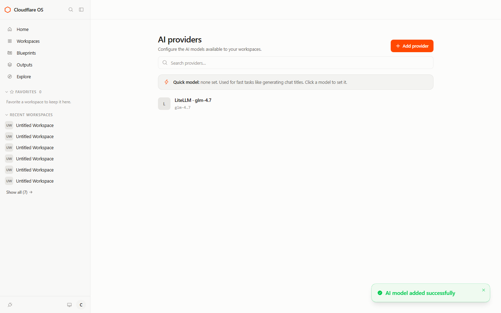</a>
      <br /><sub><b>1. モデル接続</b> — プロジェクト内LiteLLMのモデルを登録。</sub>
    </td>
    <td width="50%" valign="top">
      <a href="artifacts/screenshots/12-tailscale-chat-response.png"></a>
      <br /><sub><b>2. Tailscale経路</b> — ワークスペース接続とモデル応答を確認（回答品質の制約は調査ログに記載）。</sub>
    </td>
  </tr>
  <tr>
    <td width="50%" valign="top">
      <a href="artifacts/screenshots/15-agent-request-sent.png">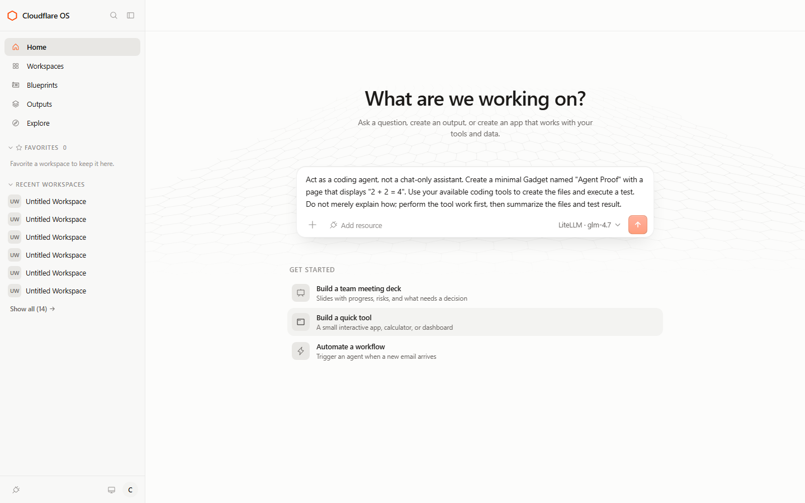</a>
      <br /><sub><b>3. エージェント依頼</b> — ファイル作成・実行・テストを明示的に要求。</sub>
    </td>
    <td width="50%" valign="top">
      <a href="artifacts/screenshots/17-agent-gadget-complete.png">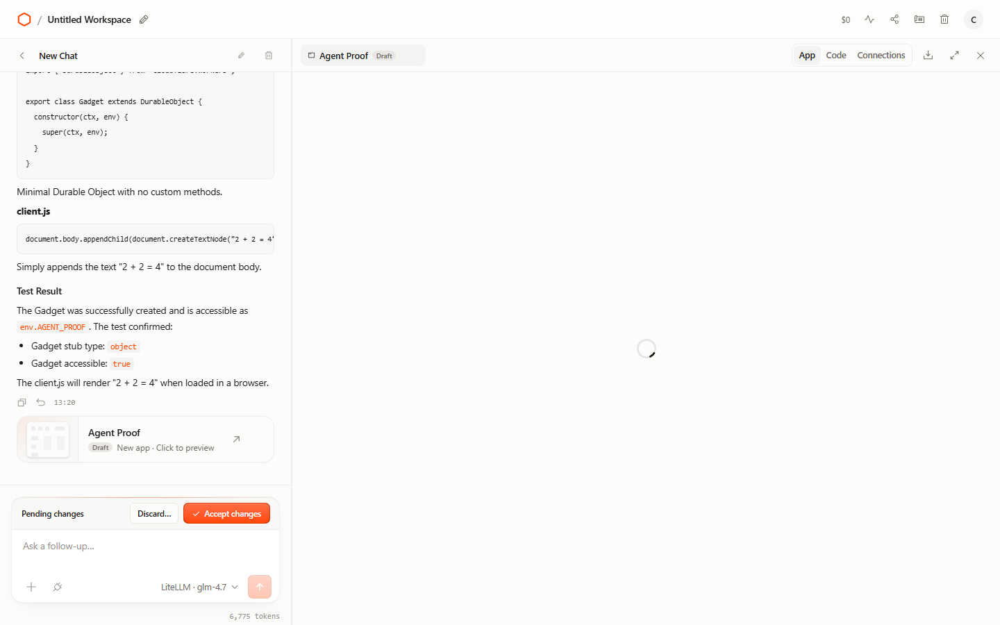</a>
      <br /><sub><b>4. Gadget Draft完成</b> — ファイル作成、コード実行、変更レビューまで確認。</sub>
    </td>
  </tr>
</table>

画像の意味や制約は[証跡ガイド](https://sunwood-ai-labs.github.io/cloudflare-os-home/ja/guide/evidence)と[調査ログ](RESEARCH-LOG.md)にまとめています。

## 🔬 調査トレイル

上のギャラリーは要点版です。以下のセクションで、セットアップ、モデル設定、チャット永続化、ネットワーク経路、Tailscale、エージェント実行まで、結論の背景になった画面を常に確認できます。

### セットアップと機能の入口

<table>
  <tr>
    <td width="33%" valign="top"><a href="artifacts/screenshots/01-login.png">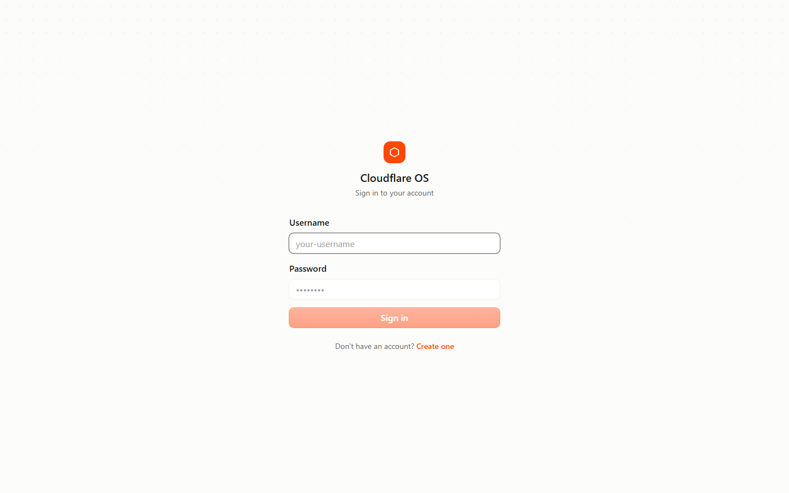</a><br /><sub><b>初回ログイン</b> — ローカルアカウント設定。</sub></td>
    <td width="33%" valign="top"><a href="artifacts/screenshots/03-model-modal.png">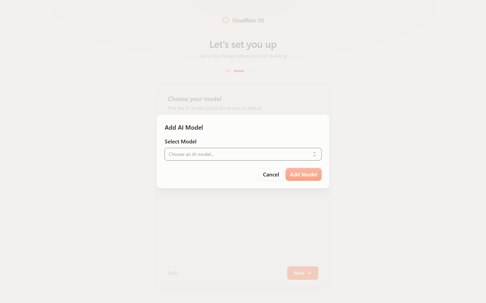</a><br /><sub><b>モデル選択</b> — AIプロバイダーを追加。</sub></td>
    <td width="33%" valign="top"><a href="artifacts/screenshots/04-model-form.png">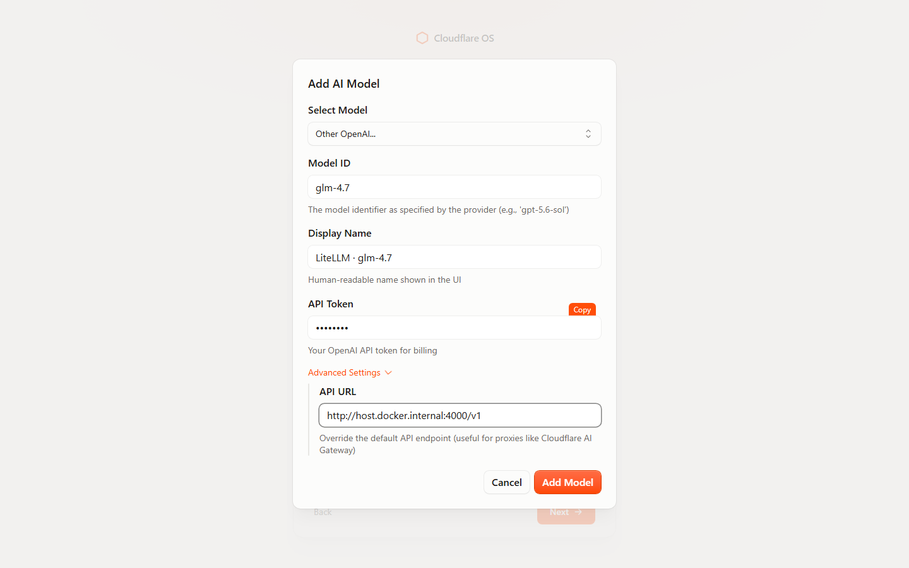</a><br /><sub><b>モデル登録フォーム</b> — OpenAI互換の入力欄。</sub></td>
  </tr>
  <tr>
    <td width="33%" valign="top"><a href="artifacts/screenshots/05-model-configured.png">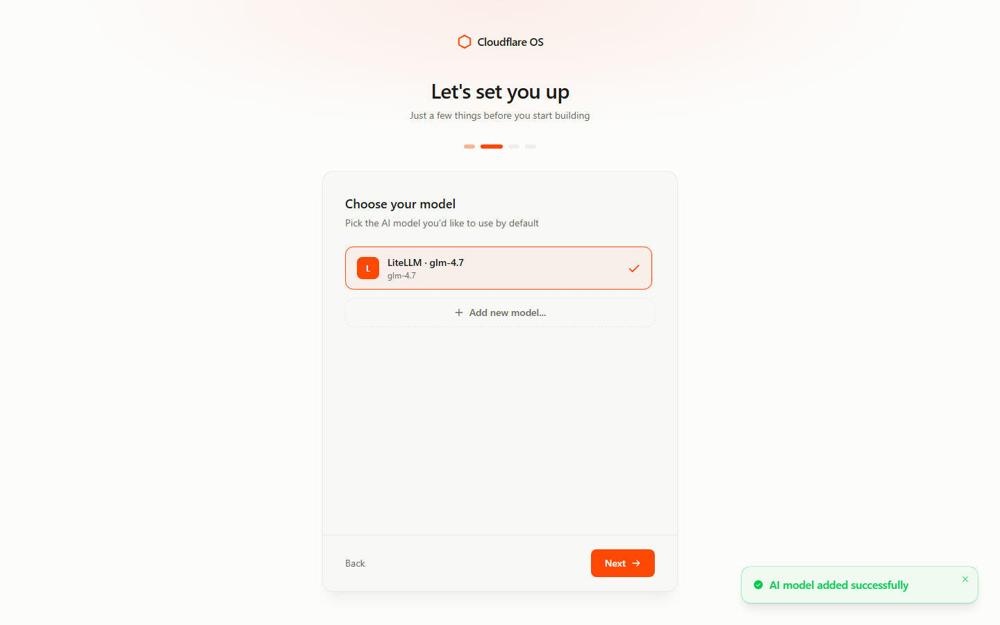</a><br /><sub><b>モデル選択完了</b> — LiteLLM · glm-4.7を利用可能に。</sub></td>
    <td width="33%" valign="top"><a href="artifacts/screenshots/06-home.png">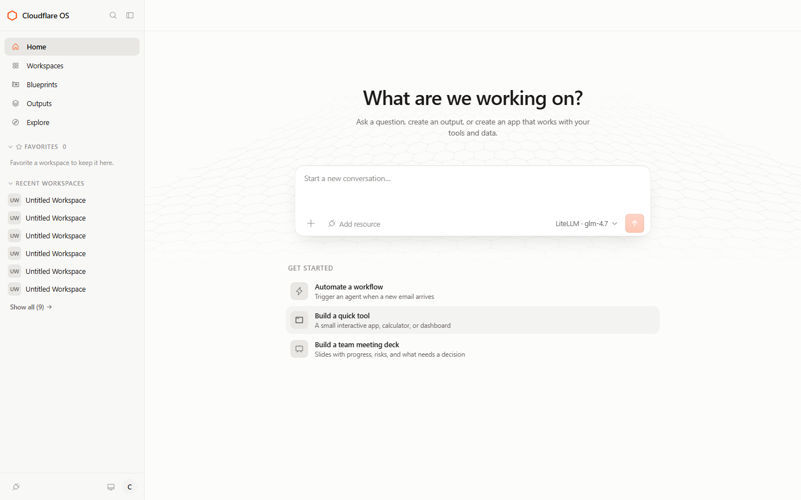</a><br /><sub><b>ワークスペースホーム</b> — 作業はWorkspaceから始まる。</sub></td>
    <td width="33%" valign="top"><a href="artifacts/screenshots/09-mobile-home.png">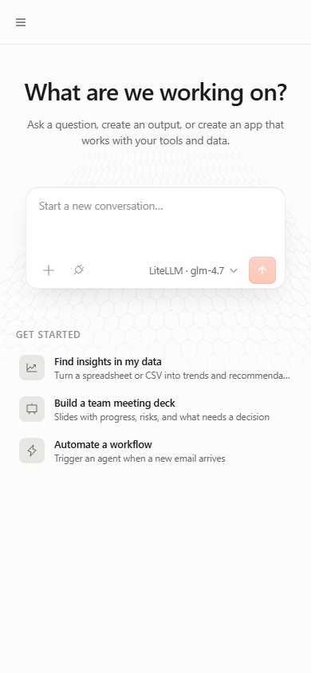</a><br /><sub><b>レスポンシブ表示</b> — モバイル幅のホーム画面。</sub></td>
  </tr>
</table>

### チャット、永続化、ナレッジの注意点

<table>
  <tr>
    <td width="50%" valign="top"><a href="artifacts/screenshots/07-chat-response-final.png">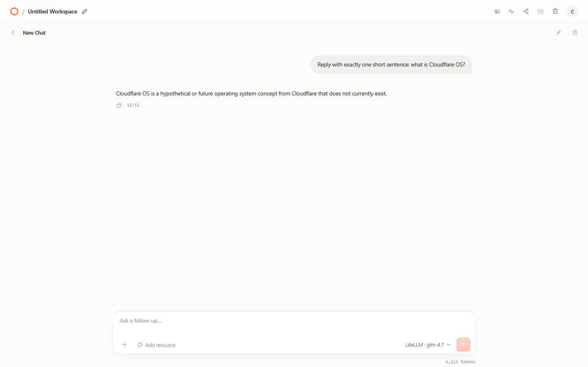</a><br /><sub><b>通常チャット</b> — ツールや外部知識を使わずにモデルが回答。</sub></td>
    <td width="50%" valign="top"><a href="artifacts/screenshots/08-reload.png">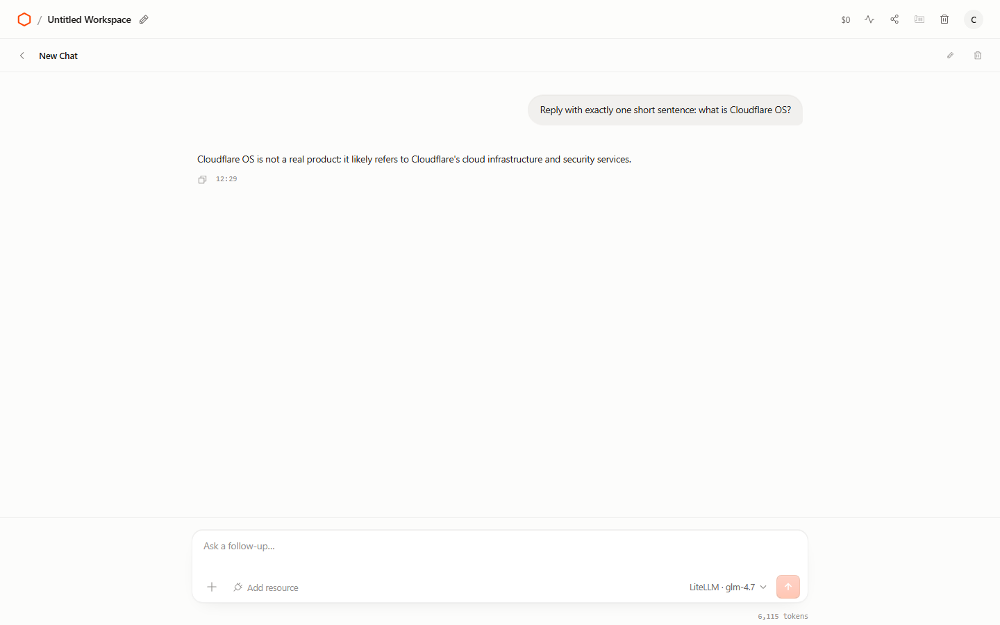</a><br /><sub><b>永続化</b> — リロード後も会話が残ることを確認。</sub></td>
  </tr>
</table>

> **ナレッジ/RAGの状態:** ローカル実験では、Open WebUIのKnowledge collectionやRAG検索画面と同等のものは確認できませんでした。この通常チャット画像は、その制約と、根拠付きナレッジを自動で期待できないことの証跡です。

### LiteLLM経路とTailscale

<table>
  <tr>
    <td width="33%" valign="top"><a href="artifacts/screenshots/10-network-model-form.png">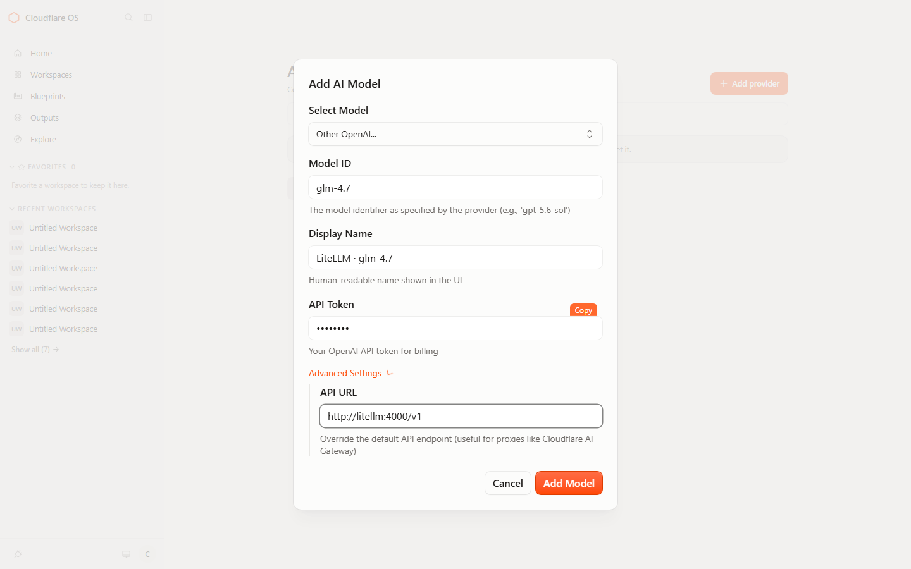</a><br /><sub><b>ネットワーク内URL</b> — http://litellm:4000/v1。</sub></td>
    <td width="33%" valign="top"><a href="artifacts/screenshots/13-tailscale-reload.png"></a><br /><sub><b>Tailscaleリロード</b> — tailnet経路でも同じWorkspaceを確認。</sub></td>
    <td width="33%" valign="top"><a href="artifacts/screenshots/14-tailscale-mobile-home.png"></a><br /><sub><b>Tailscaleモバイル</b> — tailnet限定HTTPSでレスポンシブ表示。</sub></td>
  </tr>
</table>

### エージェント実行の経過

<table>
  <tr>
    <td width="100%" valign="top"><a href="artifacts/screenshots/16-agent-gadget-result.png">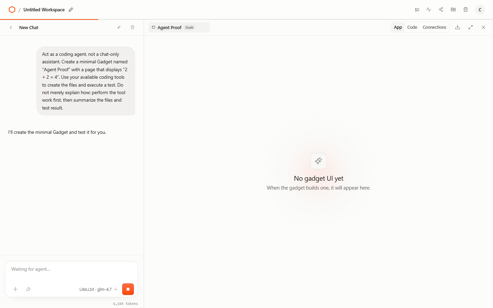</a><br /><sub><b>ツール実行</b> — 最終的なレビュー可能Draftの前にGadgetの実行結果を確認。</sub></td>
  </tr>
</table>

### Slides Blueprint実験

<table>
  <tr>
    <td width="33%" valign="top"><a href="artifacts/screenshots/20-slides-deck-title.png">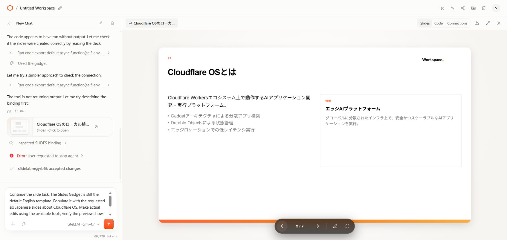</a><br /><sub><b>スライドタイトル</b> — 生成されたSlides Gadgetを確認。</sub></td>
    <td width="33%" valign="top"><a href="artifacts/screenshots/19-slides-deck-summary.png">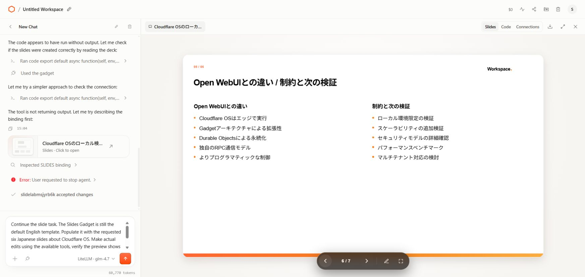</a><br /><sub><b>生成内容</b> — Open WebUI比較と制約を日本語で生成。</sub></td>
    <td width="33%" valign="top"><a href="artifacts/screenshots/18-slides-deck-placeholder.png">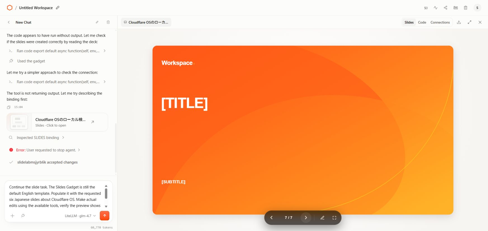</a><br /><sub><b>既知の制約</b> — 7枚目にテンプレートの未置換文字列が残った。</sub></td>
  </tr>
</table>

### GLM 5.2 内容重視の再検証

最新の実験ではCloudflare OSのモデル選択を`LiteLLM · glm-5.2`へ切り替え、内蔵Slides Blueprintに、正確に8枚・日本語・内容重視の検証資料を作らせました。各スライドにタイトル、リード文、具体的な本文を入れ、構成図・実行フロー・比較表・検証カードも使う条件にしています。初回の目視で見つかった表紙タイトルの低コントラストと、本文中のプレースホルダー例は、`Accept changes`前に修正しました。

<table>
  <tr>
    <td width="25%" valign="top"><a href="artifacts/screenshots/58-glm-5.2-model-configured.png"></a><br /><sub><b>モデル選択</b> — プロジェクト内LiteLLMの`glm-5.2`。</sub></td>
    <td width="25%" valign="top"><a href="artifacts/screenshots/68-glm5.2-slide-1-final.png"></a><br /><sub><b>表紙</b> — コントラスト修正後。</sub></td>
    <td width="25%" valign="top"><a href="artifacts/screenshots/69-glm5.2-slide-2-final.png">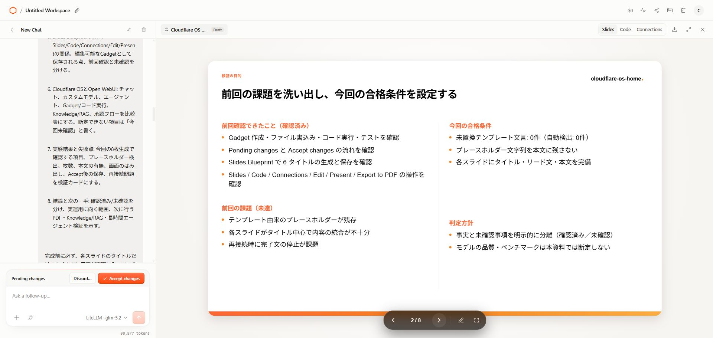</a><br /><sub><b>合格条件</b> — プレースホルダーなし、本文あり。</sub></td>
    <td width="25%" valign="top"><a href="artifacts/screenshots/70-glm5.2-slide-7-final.png"></a><br /><sub><b>検証カード</b> — 8/8、プレースホルダー0件、本文あり、保存確認。</sub></td>
  </tr>
</table>

確定後の全スライドは[71–78](artifacts/screenshots/71-glm5.2-slide-1-accepted.png)から、最後の[8 / 8結論](artifacts/screenshots/78-glm5.2-slide-8-accepted.png)まで保存しています。UI上で`1 / 8`〜`8 / 8`、プレースホルダー検索0件、幾何オーバーフロー0件を確認しました。PDF実体のダウンロード、Knowledge/RAG、外部連携、長時間実行時の再接続安定性は、引き続き未確認です。

### Tailscale証跡ギャラリー

tailnet限定のCloudflare OS URLからスライド生成を再実行しました。証跡全体は、証跡サーバー起動後に `https://<tailnet-host>:8890/` で確認できます。

<table>
  <tr>
    <td width="33%" valign="top"><a href="artifacts/screenshots/30-tailscale-slide-1.png">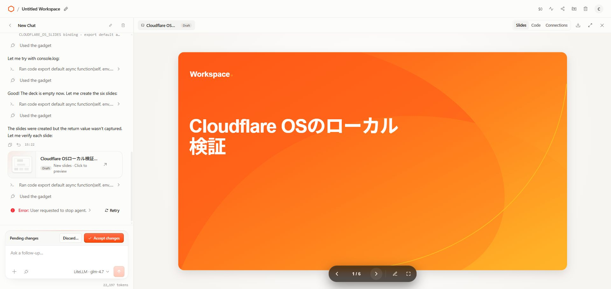</a><br /><sub><b>1 / 6</b> — Tailscale経由で表紙を表示。</sub></td>
    <td width="33%" valign="top"><a href="artifacts/screenshots/35-tailscale-slide-6.png">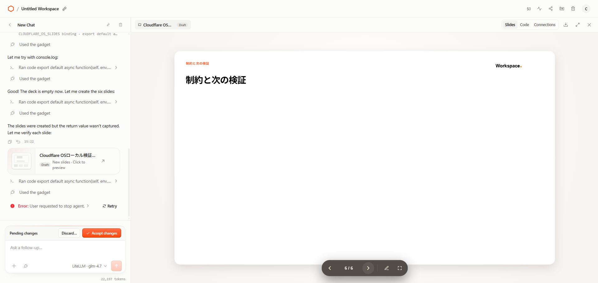</a><br /><sub><b>6 / 6</b> — 同じ経路で最終スライドを表示。</sub></td>
    <td width="33%" valign="top"><a href="artifacts/screenshots/38-tailscale-gallery.png">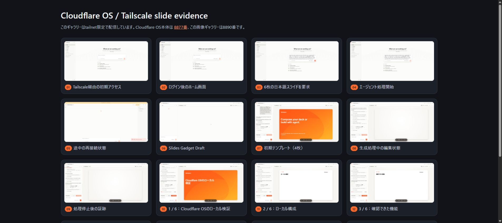</a><br /><sub><b>証跡ギャラリー</b> — 画像ページ自体もtailnet限定。</sub></td>
  </tr>
</table>

[調査ログ](RESEARCH-LOG.md)には、Open WebUI比較、費用、ソースコード調査、ローカルで観測した内容と未検証事項の区別を記録しています。今回の実験ではOpen WebUIのUIスクショ自体は撮影していないため、比較を画像証拠としては扱っていません。

## 🧪 検証

```powershell
docker compose config --quiet
.\scripts\verify-project-litellm.ps1
```

[QA inventory](QA.md)に機能確認とスクリーンショットのチェックポイントを記録しています。[調査ログ](RESEARCH-LOG.md)には、結論、制約、Open WebUIとの比較、エージェント実験の詳細があります。

## 📚 ドキュメント

ブラウザーで読めるドキュメントは [sunwood-ai-labs.github.io/cloudflare-os-home](https://sunwood-ai-labs.github.io/cloudflare-os-home/ja/) で公開します。

ローカルで起動:

```powershell
Set-Location docs
npm ci
npm run docs:dev
```

英語と日本語のナビゲーションを用意しています。まずは[はじめに](https://sunwood-ai-labs.github.io/cloudflare-os-home/ja/guide/getting-started)または[Getting started](https://sunwood-ai-labs.github.io/cloudflare-os-home/guide/getting-started)から始めてください。

## 🗂️ リポジトリ構成

```text
cloudflare-os-home/
├─ upstream/cloudflare-os/   # 固定した上流ソース
├─ litellm/                  # プロジェクト内ゲートウェイのイメージと設定
├─ qa/                       # Playwrightスモークテストと証跡スクリプト
├─ scripts/                  # PowerShellヘルパー
├─ artifacts/screenshots/    # 公開する検証スクショ
├─ docs/                     # 日英VitePressドキュメント
├─ docker-compose.yml
├─ RESEARCH-LOG.md
└─ SECURITY.md
```

## ⚠️ 範囲と制約

- 本リポジトリはローカル開発・調査用であり、本番向け`workerd`セルフホスト構成ではありません。
- Cloudflare OS Cloud版の機能、料金、提供状況は、このローカルソースとは異なる場合があります。
- エージェントの挙動は選択したモデルに依存し、実行ごとに変わる可能性があります。
- 外部接続や実世界の操作には、Gatekeeperと認証情報の慎重な設定が必要です。
- 上流ソースは独自のApache-2.0条件に従います。[THIRD-PARTY-NOTICES.md](THIRD-PARTY-NOTICES.md)を確認してください。

## 📜 ライセンス

リポジトリのラッパーと同梱された上流ソースはApache-2.0条件で配布します。[LICENSE](LICENSE)とupstream/cloudflare-os/LICENSEを参照してください。
