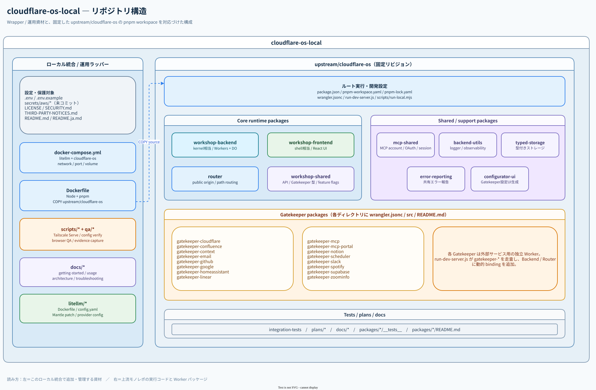

<div align="center">
  
  <h1>Cloudflare OS Home</h1>
  <p>Unofficial self-hosted Cloudflare OS workspace with project-local LiteLLM, Docker Compose, and Tailscale.</p>
  <p>
    <a href="https://github.com/Sunwood-ai-labs/cloudflare-os-home/actions/workflows/ci.yml"></a>
    <a href="https://github.com/Sunwood-ai-labs/cloudflare-os-home/actions/workflows/pages.yml"></a>
    <a href="LICENSE"></a>
    <a href="https://docs.docker.com/compose/"></a>
  </p>
  <p>
    <a href="README.ja.md">日本語</a>
    ·
    <a href="https://sunwood-ai-labs.github.io/cloudflare-os-home/">Documentation</a>
    ·
    <a href="https://github.com/Sunwood-ai-labs/cloudflare-os-home-lab">Research Lab</a>
    ·
    <a href="https://github.com/Sunwood-ai-labs/cloudflare-os-home/issues">Issues</a>
  </p>
</div>

## ✨ What this is

Cloudflare OS Home is a reproducible local runtime for exploring Cloudflare OS as an agent-first workspace. It keeps the upstream source, project-local LiteLLM route, Docker Compose networking, Tailscale Serve instructions, and browser QA together in one operational repository.

This is an unofficial integration, not a Cloudflare-hosted product or official distribution. Detailed experiments, screenshots, HyperFrames assets, and feature conclusions live in the separate [Cloudflare OS Home Lab](https://github.com/Sunwood-ai-labs/cloudflare-os-home-lab) repository.

## 🚀 What you get

- Cloudflare OS source pinned to upstream revision `004ab773` (2026-09-26: `workerd 1.20260921.1`, Pi `0.87.1`, child-agent Worktrees, Restricted mode full-text manual approval, and git-backed storage).
- Project-local LiteLLM with an OpenAI-compatible endpoint at `http://litellm:4000/v1`.
- `agent-runner`: Claude Code (on GLM), Codex, Antigravity, and Hermes Agent exposed as the LiteLLM models `claude-code-glm`, `codex`, `antigravity`, and `hermes`, using local logins.
- A 32-model configuration template (including `glm-4.7`, `glm-5.2`, `glm-5.3-flash`, and five optional coding-agent routes) with provider credentials loaded from `.env`.
- Repeatable upstream sync script (`scripts/sync-upstream.ps1`) that updates `upstream/cloudflare-os/` and re-applies the local container overlay.
- Docker Compose networking that does not depend on an external Open WebUI network.
- Optional tailnet-only HTTPS access through Tailscale Serve.
- Browser QA scripts for model registration, chat persistence, responsive layout, and agentic Gadget creation.
- A separate evidence repository for detailed experiment records and screenshots.

## 🧭 Choose your path

| Goal | Start here |
| --- | --- |
| Run the local workspace | [Quick start](#-quick-start) |
| Pull newer upstream Cloudflare OS commits | [Syncing upstream](#-syncing-upstream-cloudflare-os) |
| Understand the containers | [Architecture](https://sunwood-ai-labs.github.io/cloudflare-os-home/guide/architecture) |
| Reproduce the agent test | [Agent smoke test](#-agent-smoke-test) |
| Configure tailnet-only access | [Tailscale access](#-tailscale-access) |
| Read experiment results and screenshots | [Cloudflare OS Home Lab](https://github.com/Sunwood-ai-labs/cloudflare-os-home-lab) |
| Diagnose a failed setup | [Troubleshooting](https://sunwood-ai-labs.github.io/cloudflare-os-home/guide/troubleshooting) |

## ⚡ Quick start

Prerequisites: Docker Desktop with the Linux engine enabled and PowerShell.

```powershell
git clone https://github.com/Sunwood-ai-labs/cloudflare-os-home.git
Set-Location cloudflare-os-home
Copy-Item .env.example .env
notepad .env
docker compose up --build -d
```

Open `http://localhost:8877` and create a local account on first use. At minimum, set `LITELLM_MASTER_KEY` in `.env`; provider API keys are only required for the routes you intend to call. AWS profile files are optional and are never committed.

Stop the stack with:

```powershell
docker compose down
```

Named volumes preserve local Worker state. Use `docker compose down -v` only when you intentionally want to remove that state.

## 🔐 Environment and secrets

`.env.example` is safe to copy, but it is intentionally incomplete. Keep real values in `.env`:

- `LITELLM_MASTER_KEY` for the project-local LiteLLM API.
- Provider keys such as `ZAI_API_KEY`, `NVIDIA_API_KEY`, and `GEMINI_API_KEY` when needed.
- `CFOS_PUBLIC_BASE_URL` and `CFOS_BACKEND_HOST` when using a non-local browser endpoint.
- AWS profiles only when using the optional Bedrock Mantle routes.

Never commit `.env`, `secrets/`, AWS profiles, or browser credentials. See [SECURITY.md](SECURITY.md).

## 🧩 Architecture

```text
Browser
  │ http://localhost:8877 or a tailnet-only Tailscale URL
  ▼
Cloudflare OS container
  │ http://litellm:4000/v1
  ▼
Project-local LiteLLM container
  │
  ▼
Configured model providers
```

Cloudflare OS owns the workspace, agent loop, Gadget tools, and reviewable changes. LiteLLM owns OpenAI-compatible model routing. The model itself is interchangeable; the runtime was exercised with `glm-4.7` and `glm-5.2`.

### Architecture diagrams

The editable draw.io source is [`docs/cloudflare-os-architecture.drawio`](docs/cloudflare-os-architecture.drawio). The exported SVGs are shown below so the architecture is visible directly from the repository README.

<p align="center">
  
</p>

<p align="center"><em>Runtime architecture: Docker Compose, Cloudflare OS, Gatekeepers, LiteLLM, and external providers.</em></p>

<p align="center">
  
</p>

<p align="center"><em>Repository structure: the local integration wrapper and the pinned upstream monorepo.</em></p>

## 🧠 Coding agents (Claude Code, Codex, Antigravity, Hermes)

Cloudflare OS runs its own Pi agent loop. The `agent-runner` service adds four external coding agents
as selectable models, following OpenMausBot's Podman setup (engines in a container, logins from the
local machine):

| LiteLLM model | Agent | Login / model |
| --- | --- | --- |
| `claude-code-glm` | Claude Code | GLM (`glm-5.2`) through the project LiteLLM |
| `codex` | Codex CLI | host `~/.codex/auth.json` (`CODEX_AUTH_FILE`) |
| `antigravity` | Antigravity ACP server | OpenMausBot's signed-in Linux runtime/profile in the Podman machine |
| `hermes` | Hermes Agent (`hermes acp`) | GLM (`glm-5.2`) through the project LiteLLM |

`agent-runner` listens only on the Compose network. Requests without Pi tools use
`/workspace/<agent>`; Pi-enabled requests use dedicated workspaces and retain the native process
while waiting for Pi tool results. File edits are allowed there, shell commands are not auto-approved. Register the
models in Cloudflare OS like any LiteLLM model (**Other OpenAI...**, API URL `http://litellm:4000/v1`).
The coding agents are optional; the normal quickstart keeps running without their credentials or mounts.
To enable all four agents, set a strong `AGENT_RUNNER_TOKEN`, `CODEX_AUTH_FILE`,
`ANTIGRAVITY_RUNTIME_DIR`, and `ANTIGRAVITY_PROFILE_DIR` in `.env`. The Antigravity directories
must point to an installed Linux ACP runtime and signed-in profile inside your container engine's machine.
Claude Code and Hermes also require the LiteLLM `glm-5.2` route to be configured.

```powershell
docker compose -f docker-compose.yml -f docker-compose.agents.yml up --build -d
```

Use both Compose files when managing the optional agents. Their five LiteLLM routes are usable after
the runner is started; unconfigured agents return an explicit availability error.

### 🔗 Automatic Pi MCP sharing

MCP connections granted in a Pi chat are available to `claude-code-glm`, `codex`, `antigravity`, `hermes`, and `agent-team`. Each agent receives a `cloudflare_os` MCP exposing the Pi tools supplied with that model request. Use `describeBinding` to inspect connections and `executeCode` to call the same MCP bindings. No separate per-agent MCP configuration file is required.

Calls return to Pi for execution, preserving chat grants, observation records, and write approvals. Upstream OAuth tokens stay with Pi. Connection changes take effect on the next model request.

The native agent waits for Pi's tool result. After session expiry or a runner restart, a new native process receives recorded tool results as history. See the [usage guide](https://sunwood-ai-labs.github.io/cloudflare-os-home/guide/usage#share-pi-mcp-with-every-agent) for configuration and verification.

### 🤝 Agent Team (`agent-team`)

A fifth model, `agent-team`, makes the four agents work together on a shared workspace, streaming
each stage into the chat as it finishes. Pi requests use a dedicated workspace for that request;
requests without Pi tools use `/workspace/agent-team`.

1. 🧭 **Plan**: Antigravity writes an implementation plan (read-only)
2. 🛠️ **Implement**: Claude Code (GLM) creates and edits the files
3. 🔍 **Review**: Codex reviews the files and performs checks permitted by its native policy, answering `VERDICT: APPROVE` or `CHANGES_REQUESTED`
4. 🩹 **Fix**: on `CHANGES_REQUESTED`, Claude Code fixes and Codex re-reviews (up to `TEAM_MAX_FIX_ROUNDS`, default 2)
5. 📝 **Summary**: Hermes writes the final answer (read-only)

Roles can be swapped with `TEAM_PLANNER`, `TEAM_IMPLEMENTER`, `TEAM_REVIEWER` and `TEAM_SUMMARIZER`. A small
task takes about 2–3 minutes. Stage icons are Font Awesome 6 SVGs from the Iconify CDN
(`api.iconify.design`, fetched by the browser); set `TEAM_ICONS=emoji` to use emoji instead. `qa/agent-team-chat.mjs` registers the model and runs one task in the browser.

## 🔄 Syncing upstream Cloudflare OS

`upstream/cloudflare-os/` is pinned to a specific upstream commit (`004ab773fad6d4fb7fe67be920a3ef37e46dc58a` as of 2026-09-26) rather than pulling unreviewed changes during `docker compose up`. To pull the latest `cloudflare/cloudflare-os` `main` (or a specific commit/branch) and re-apply the local container overlay:

```powershell
.\scripts\sync-upstream.ps1
docker compose up --build -d
```

You can also target a specific upstream ref:

```powershell
.\scripts\sync-upstream.ps1 -Ref <commit-or-branch>
```

## 🌐 Tailscale access

Tailscale Serve can provide tailnet-only HTTPS without opening a public Funnel endpoint:

```powershell
$env:CFOS_PUBLIC_BASE_URL = 'https://<your-tailnet-host>:8877'
$env:CFOS_BACKEND_HOST = '<your-tailnet-host>:8877'
docker compose up -d --force-recreate cloudflare-os
.\scripts\enable-tailscale-serve.ps1
```

The helper prints the actual tailnet URL. Keep the endpoint private to your tailnet and review the authentication model before sharing it.

## 🤖 Agent smoke test

The included smoke test asks Cloudflare OS to create a minimal Gadget, write `server.js` and `client.js`, execute a test, and report the result. Supply credentials explicitly:

```powershell
$env:CFOS_USERNAME = 'your-local-account'
$env:CFOS_PASSWORD = 'your-local-password'
$env:BASE_URL = 'http://localhost:8877'
node .\qa\agentic-gadget-smoke.mjs
```

The run should produce a Gadget draft with `Pending changes`, `Accept changes`, and `Discard`. Detailed interpretation and visual evidence belong in the [Cloudflare OS Home Lab](https://github.com/Sunwood-ai-labs/cloudflare-os-home-lab).

## 🧪 Runtime QA

The CI workflow validates the Compose file, QA script syntax, public-payload exclusions, and whitespace. The VitePress documentation build runs in the same workflow. For experiment-level claims, use the [Lab QA inventory](https://github.com/Sunwood-ai-labs/cloudflare-os-home-lab/blob/main/QA.md).

## 📚 Documentation

- [Getting started](https://sunwood-ai-labs.github.io/cloudflare-os-home/guide/getting-started)
- [Usage](https://sunwood-ai-labs.github.io/cloudflare-os-home/guide/usage)
- [Architecture](https://sunwood-ai-labs.github.io/cloudflare-os-home/guide/architecture)
- [Troubleshooting](https://sunwood-ai-labs.github.io/cloudflare-os-home/guide/troubleshooting)
- [Experiment records and evidence](https://github.com/Sunwood-ai-labs/cloudflare-os-home-lab)

## 📜 License

The repository is Apache-2.0 licensed. Upstream notices and third-party terms are listed in [THIRD-PARTY-NOTICES.md](THIRD-PARTY-NOTICES.md).
